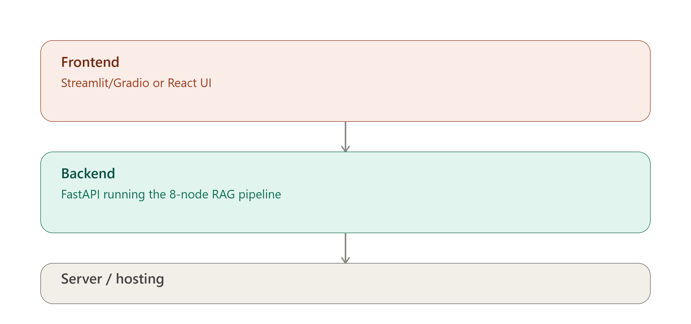

# SentinelRAG

A retrieval-augmented cybersecurity assistant. Ask about a CVE, a MITRE ATT&CK
technique, an ICS-CERT advisory, or an internal SOP, and it answers strictly
from retrieved, cited sources — with hybrid (vector + keyword) search,
cross-encoder re-ranking, guardrails against exploit-generation requests, and
a confidence score on every answer.

## Pipeline

1. **Data sources** — CVE/NVD, MITRE ATT&CK, ICS-CERT, internal SOPs
2. **Preprocessing & chunking**
3. **Embedding & indexing** — hybrid vector (fastembed/ONNX) + BM25 keyword index
4. **Retrieval & re-ranking** — cross-encoder re-ranker
5. **Grounded generation** — Claude or Groq, answers cited to source excerpts
6. **Guardrails & safety** — intent classification, exploit-request refusal, confidence scoring
7. **Evaluation** — golden-set faithfulness scoring
8. **Deployment & monitoring** — this FastAPI app + frontend

## Note for visitors

This demo calls a free-tier LLM API (Groq) with a daily token cap. If it
returns a rate-limit error, it isn't broken — the daily quota reset within a
few minutes to hours, or the maintainer needs to top it up.
